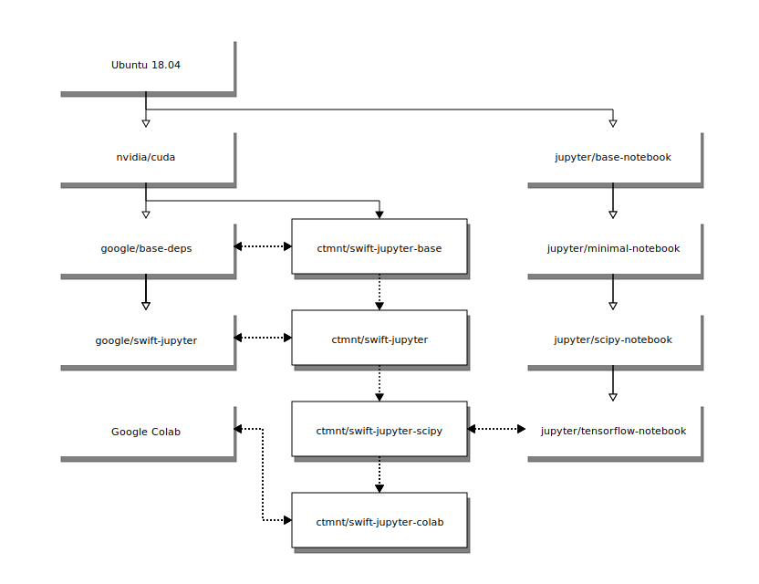

# Swift for Tensorflow Docker stacks

## Overview


`blockdiag -T svg docker-image-hierarchy.diag`

## Project goals
1. Replicate all of the functionality of Google's Swift for Tensorflow images (shown on the left in [the overview diagram](#project-goals))
1. Replicate some of the functionality (the library support, not additional application support) of Jupyter's Docker Stacks images (shown on the right in [the overview diagram](#project-goals))
1. Replicate some of the functionality of Google Colab

## Image details
### swift-jupyter-base
- Built from the nvidia/cuda:10.2-cudnn7-devel-ubuntu18.04 image
- Comparable to the google/base-deps image (see below for differences)

#### Compared to google/base-deps
- `tini` as the container entrypoint
- No gym, numpy, matplotlib (installed in swift-jupyter below)

### swift-jupyter
- Built from the swift-jupyter-base image
- Minimally functional Jupyter Notebook server
- Swift for Tensorflow kernel
- Comparable to the google/swift-jupyter and jupyter/base-notebook images (see below for differences)

#### Compared to google/swift-jupyter
- `tini` as the container entrypoint
- No Python 2.7 integration
- Node installed for better Jupyter Lab support
- Preinstalled packages:
  - gym, ipykernel, jupyterhub, jupyterlab, jupyter-kernel-test, notebook, matplotlib, numpy, pandas

#### Compared to jupyter/base-notebook
- No `start.sh`, `start-notebook.sh`, or `start-singleuser.sh`
- No conda installation
- Only root user
- No self-signed HTTPS certificate
- No passwordless `sudo`
- None of the [common features](https://jupyter-docker-stacks.readthedocs.io/en/latest/using/common.html)

### swift-jupyter-scipy
- Built from the swift-jupyter image
- Preinstalled packages:
  - beautifulsoup, bokeh, bottleneck, cloudpickle, cython, dask, dill, hdf5, ipympl, ipywidgets, keras, numba, numexpr, matplotlib, pandas, patsy, protobuf, pytables, scikit-learn, scikit-image, scipy, seaborn, sqlalchemy, statsmodel, sympy, tensorflow, vincent, xlrd

#### Compared to jupyer/scipy-notebook
- No facets installation

## Notes
### Docker Buildkit
To improve Docker image building, use the new [Docker Buildkit system](https://docs.docker.com/develop/develop-images/build_enhancements/#to-enable-buildkit-builds) by either setting the `DOCKER_BUILDKIT` environment variable or configuring the Docker `daemon.json`. The simplest way is by prepending `DOCKER_BUILDKIT=1` to your `docker build` command:

```bash
DOCKER_BUILDKIT=1 docker build --file ./swift-jupyter-scipy/Dockerfile --tag ctmnt/swift-jupyter-scipy .
```
